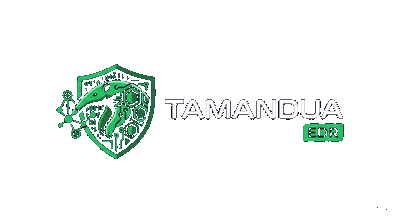

  

  <strong>Community coordination for Tamandua's open security ecosystem</strong> 
  Detection validation, endpoint evidence, response safety, and privacy-safe proof workflows.

  <a href="CONTRIBUTING.md">Contributing</a> |
  <a href="ROADMAP.md">Roadmap</a> |
  <a href="benchmarks/VALIDATION_SNAPSHOT.md">Benchmarks</a> |
  <a href="SECURITY.md">Security</a> |
  <a href="docs/REPOSITORIES.md">Repositories</a>

---

# Tamandua Community

Tamandua Community is the public entry point for people who want to discuss, test, document, and improve Tamandua across repositories.

Tamandua is a self-hosted security stack focused on endpoint evidence, detection validation, response workflows, and privacy-safe proof metadata for Web3 and security teams.

This repository is for community coordination. Product code lives in the component repositories.

## Start Here

- Read the contribution model in [CONTRIBUTING.md](CONTRIBUTING.md).
- Review safe disclosure rules in [SECURITY.md](SECURITY.md).
- Pick a contribution track in [docs/CONTRIBUTION_TRACKS.md](docs/CONTRIBUTION_TRACKS.md).
- Browse starter ideas in [docs/GOOD_FIRST_ISSUES.md](docs/GOOD_FIRST_ISSUES.md).
- Check public project boundaries in [ROADMAP.md](ROADMAP.md).
- Review the public benchmark snapshot in [benchmarks/VALIDATION_SNAPSHOT.md](benchmarks/VALIDATION_SNAPSHOT.md).

## Repositories

| Repository | Purpose |
| --- | --- |
| `tamandua-server` | Phoenix server, API, console, detections, alerts, investigations, and orchestration. |
| `tamandua-agent` | Endpoint agent, collectors, transport, local response, and platform telemetry. |
| `tamandua-browser-extension` | Browser security extension and web-threat policy enforcement. |
| `tamandua-ctl` | CLI for operators, automation, enrollment, and admin workflows. |
| `tamandua-core` | Shared contracts, models, and utilities used by multiple components. |
| `tamandua-detection-validation` | Validation harnesses, profiles, fixtures, benchmark docs, and reproducibility workflows. |
| `tamandua-gui` | Desktop GUI where separated from the server web console. |

For code changes, open issues and pull requests in the repository that owns the component. Use this repository for cross-project proposals, public roadmap discussion, community process, detection ideas, benchmark interpretation, and contribution onboarding.

## Community Channels

- Discord: fast onboarding, support triage, demos, and coordination.
- GitHub Discussions: durable Q&A, roadmap proposals, benchmark interpretation, and detection design.
- GitHub Issues: actionable work with reproduction details or a concrete proposal.
- Security email: vulnerability reports and sensitive disclosure only.

Do not post credentials, private keys, customer telemetry, live malware samples, exploit payloads, or sensitive vulnerabilities in public channels.

## Contribution Areas

- Detection engineering: Sigma/YARA logic, ATT&CK mapping, false-positive analysis, and rule metadata.
- Endpoint telemetry: field quality, normalization, source health, and collector reliability.
- Benchmark lab: safe profiles, reproducible runs, report scoring, and benign workload baselines.
- UX and analyst experience: alert evidence, storyline clarity, missing-data states, and triage affordances.
- Infrastructure and deployment: self-hosted setup, health checks, troubleshooting, and rollback docs.
- Response safety: auditability, authorization, rollback guidance, and lab-safe validation.

## Public Claims

Tamandua treats validation as part of the product. Benchmark claims should identify:

- the profile or scenario;
- the environment and version or commit;
- expected telemetry;
- observed telemetry;
- detections and alerts generated;
- missing fields, misses, false positives, or known gaps;
- sanitized artifacts or reproduction notes.

Screenshots are useful context, but they are not a substitute for reproducible evidence.

Current public benchmark docs:

- [Validation Snapshot](benchmarks/VALIDATION_SNAPSHOT.md)
- [Methodology](benchmarks/METHODOLOGY.md)
- [Windows Coverage Summary](benchmarks/WINDOWS_COVERAGE_SUMMARY.md)
- [False Positive Regression](benchmarks/FALSE_POSITIVE_REGRESSION.md)
- [CALDERA Enterprise Safe Status](benchmarks/CALDERA_ENTERPRISE_SAFE_STATUS.md)
- [Detection Rule Metadata](benchmarks/DETECTION_RULE_METADATA.md)

## Repository Role

This repository should stay small and navigable. It should not become a copy of every component's docs or a store for large benchmark artifacts.

Good content here:

- contribution process;
- RFCs and proposals;
- public roadmap boundaries;
- issue and discussion templates;
- community moderation rules;
- links to component repositories;
- sanitized examples and lightweight benchmark interpretation.

Content that belongs elsewhere:

- component source code;
- generated benchmark run archives;
- private lab details;
- signing, deployment, or production secrets;
- customer-specific support material;
- vulnerability details before coordinated disclosure.
