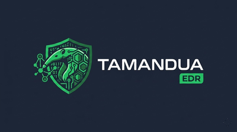

<p align="center">
  
</p>

<p align="center">
  <strong>Security Command Center for Solana and Web3 teams</strong><br>
  Endpoint detection, incident evidence, response workflows, and privacy-safe Solana attestations
</p>

<p align="center">
  <em>Advanced alpha for operators protecting signer workstations, validator/RPC hosts, developer machines, custody workflows, and treasury operations</em>
</p>

<p align="center">
  <a href="#features">Features</a> •
  <a href="#quick-start">Quick Start</a> •
  <a href="#architecture">Architecture</a> •
  <a href="#documentation">Docs</a> •
  <a href="#community">Community</a> •
  <a href="#contributing">Contributing</a>
</p>

---

## What Tamandua Is

Tamandua is a self-hosted endpoint detection and response stack with a Rust agent, Phoenix server, Tauri desktop GUI, and optional Solana proof layer. It is designed for teams that need endpoint visibility, incident evidence, response workflows, and detection validation without sending raw workstation telemetry to a vendor cloud.

For Web3 and crypto infrastructure teams, the wedge is narrower and stronger: Tamandua protects and validates the off-chain endpoint layer behind high-value on-chain actions, such as signer workstations, validator/RPC hosts, developer machines, custody workflows, and treasury operations.

The product thesis is simple: most on-chain incidents still touch off-chain systems first. Tamandua turns endpoint activity into an inspectable security timeline, lets operators respond locally, and can publish bounded proof metadata on Solana for incident accountability, disclosure, audit, or future bounty workflows.

The current implementation focuses on:

- **Windows and Linux agents** for endpoint telemetry, network visibility, and local response.
- **Network Insight** with process, DNS, domain, SNI/TLS, JA3/JA3S, certificate-risk, and enrichment fields when the underlying sensor provides them.
- **Real response actions** including block/unblock IP, block/unblock domain, network isolate/restore, process actions, quarantine, and playbook-driven containment.
- **Network/XDR correlation** for normalized endpoint network events, DNS context, flow/lateral/protocol analysis where telemetry exists, and alert evidence. Deep packet inspection and advanced NDR coverage remain roadmap work.
- **Privacy-safe attestations** where Solana stores bounded proof metadata, not endpoint telemetry.
- **Detection Validation** for proving expected telemetry, alerting, source health, and evidence quality through repeatable benchmark runs.

Tamandua does not invent packet-level evidence. TLS, JA3, certificate, SNI, and enrichment fields are present only when collected or derived from real telemetry.

---

## Why Solana Teams

Tamandua is not a wallet, custody provider, validator client, or smart contract auditor. It covers the operational security layer around those systems:

- **Signer and treasury machines**: detect suspicious PowerShell, persistence, file tampering, network egress, and process activity around high-value workstations.
- **Validator/RPC and infrastructure hosts**: monitor endpoint/network signals, preserve evidence, and execute response actions during an incident.
- **Protocol and trading teams**: keep private telemetry self-hosted while still producing evidence that can be reviewed, shared, or attested without exposing raw endpoint data.
- **Security operations for Web3**: connect alerts, timeline evidence, local response, and privacy-safe proof metadata into one workflow.

The Solana layer is intentionally bounded: it is for proof metadata and future coordination surfaces, not raw telemetry storage. Endpoint data remains private by default.

## Hackathon Demo Path

The current demo is built to be judged quickly:

1. Run a safe Windows ATT&CK-style behavior on `WIN-TEMPLATE`.
2. Tamandua agent and driver collect process, registry, file, DNS, network, and response events.
3. Server-side detection creates alerts for behaviors such as encoded PowerShell, execution-policy bypass, and Run Key persistence.
4. The dashboard exposes alert evidence and a timeline for investigation.
5. Response workflows can block, isolate, kill, quarantine, or restore depending on the action.
6. Detection Validation produces a benchmark artifact showing telemetry coverage, missing fields, unexpected high/critical noise, alert coverage, and source quality.
7. Optional Solana attestation can publish bounded incident/proof metadata without publishing private endpoint telemetry.

## Current Validation Snapshot

Status as of 2026-05-19:

- Windows VM validation target: `WIN-TEMPLATE`, VMID `1521`.
- Agent and driver services are running in the lab validation image.
- Recent validation runs show real endpoint and driver telemetry for process, registry, file, DNS, network, module-load, and response-action events.
- Detection/alert pipeline has produced high-signal alerts for encoded PowerShell, PowerShell execution-policy bypass, Run Key persistence, and registry persistence.
- Latest focused `windows-attack-safe-v1` recuts reached `pass` with zero unknown source events, zero missing expected fields, zero missing driver raw events, and zero unexpected high/critical events.
- The latest 16-test full run improved to no execution failures, no missed tests, no missing detections, no missing alerts, and no missing driver raw events; remaining full-run gaps were expected-field quality and one unknown-source event.
- Lab/demo ingestion now performs lightweight local IOC enrichment when indicators are present, using Tamandua's IOC database/cache path. External provider lookups remain opt-in and bounded by API keys/configuration.

Validation is part of the product, not a marketing afterthought. The benchmark artifacts are designed to show what Tamandua saw, what it missed, and whether the alert evidence is usable.

## Threat Intelligence Enrichment

Tamandua already includes a threat-intelligence layer for IOC matching and optional external enrichment:

- **Local IOC database/cache** for IPs, domains, URLs, filenames, and file hashes.
- **Abuse.ch coverage** for MalwareBazaar, URLHaus, and ThreatFox.
- **Optional premium/API-backed providers** including VirusTotal, AlienVault OTX, Shodan, URLScan, PassiveTotal, and Hybrid Analysis where API keys are configured.
- **Telemetry enrichment** that extracts observables from endpoint/network events and adds matches under event enrichment.
- **IOC APIs and UI** for batch import, manual management, export, and investigation workflows.

In lab-light/demo mode, Tamandua keeps the fast local IOC enrichment path enabled by default and avoids starting the full external feed stack. Set `TAMANDUA_ENABLE_THREAT_INTEL_ENRICHMENT=false` to disable even local IOC enrichment in lightweight profiles.

## External Validation Status

Tamandua has adapters and profiles for external validation tools, but the current lab runs should be interpreted precisely:

- **Atomic Red Team**: supported when `Invoke-AtomicTest` is installed on the Windows guest. If it is absent, the runner uses deterministic safe fallback commands mapped to the same MITRE techniques.
- **MITRE CALDERA**: adapter path is designed for API-driven operations, adversary IDs, operation polling, and Tamandua evidence scoring. The current profile is adapter-ready/planned, not yet a proven live CALDERA-backed benchmark.
- **Current benchmark evidence**: strong for Tamandua-owned detection validation and safe ATT&CK-style regressions; not yet a claim that upstream Atomic Red Team or CALDERA were executed end to end in the latest runs.

---

## Overview

Tamandua is a self-hosted EDR/XDR for Web3 operators, security teams, and small fleets that want inspectable endpoint control. It combines:

- **Malware-SMELL-inspired ML**: Similarity-space malware scoring based on the Computers & Security 2022 Malware-SMELL research. Current artifacts are smoke-scale/validation-ready only; production model claims require the guarded ML-1..ML-6 benchmark chain.
- **Behavioral Analysis**: Real-time process tree and attack graph analysis
- **YARA/Sigma**: Deterministic rules for known threats
- **Deception**: Honeyfiles and honeytokens for ransomware detection
- **Network Insight**: DNS correlation, network events, encrypted traffic metadata, and server-side analysis without inventing packet-level fields
- **Automated Response**: IP/domain blocking, network isolation, kill, quarantine, and playbooks
- **Solana Attestation**: Optional privacy-preserving incident proofs
- **Detection Validation**: Tamandua-owned scoring for whether simulated behavior produced usable telemetry, alerts, timelines, and evidence

## Architecture

```
┌─────────────────────────────────────────────────────────────────┐
│                        TAMANDUA EDR                              │
├─────────────────────────────────────────────────────────────────┤
│  ENDPOINTS          SERVER               INTELLIGENCE            │
│  (Rust Agent)  -->  (Elixir/Phoenix) --> (Python ML/NDR)        │
│       │                   │                   │                  │
│       v                   v                   v                  │
│  KERNEL/eBPF        STORAGE/NDR         THREAT INTEL             │
│  ETW/WFP/Linux      PostgreSQL          External APIs            │
│                                                                  │
│  ┌────────────────────────────────────────────────────────────┐ │
│  │       GUI / DASHBOARD / LIVE RESPONSE / ATTESTATIONS        │ │
│  └────────────────────────────────────────────────────────────┘ │
└─────────────────────────────────────────────────────────────────┘
```

## Project Structure

```
tamandua/
├── apps/
│   ├── tamandua_server/      # Elixir Phoenix backend
│   ├── tamandua_ml/          # Python ML service (Malware-SMELL)
│   ├── tamandua_agent/       # Rust endpoint agent
│   ├── tamandua_gui/         # Tauri + React desktop GUI
│   └── tamandua_driver/      # C kernel drivers (Windows/Linux)
├── libs/
│   └── tamandua_proto/       # Protocol Buffers definitions
├── deploy/
│   ├── docker/
│   ├── kubernetes/
│   └── ansible/
├── docs/
└── tests/
```

## Quick Start

### Prerequisites

- Docker & Docker Compose
- Elixir 1.15+ (for backend development)
- Rust 1.74+ (for agent development)
- Python 3.11+ (for ML service)
- PostgreSQL 16 + TimescaleDB

### Development Setup

```bash
# Start from the public community hub and component mirrors
git clone https://github.com/treant-lab/tamandua-community.git
cd tamandua-community

# Start infrastructure
make dev-up

# Setup backend
make backend-setup

# Setup ML service
make ml-setup

# Run all services
make dev-run
```

### Build Agent

```bash
# Build for current platform
make agent-build

# Build for Windows
make agent-build-windows

# Build for Linux
make agent-build-linux
```

## Detection Capabilities

| Area | Windows | Linux | Notes |
|------|---------|-------|-------|
| Process and behavioral telemetry | Supported | Supported | Process tree and event correlation feed detection and investigations |
| File and malware signals | Supported | Supported | YARA, entropy, quarantine, and deception signals |
| Network connections | Supported | Supported | Process/IP/port/protocol fields are normalized across platforms |
| DNS correlation | Supported | Supported | Recent DNS cache maps resolved IPs back to domains when available |
| Encrypted traffic metadata | Partial | Partial | SNI/TLS/JA3/cert fields require real packet or OS sensor visibility |
| Response actions | Supported | Supported | Windows uses WFP/host controls; Linux uses firewall/hosts/isolation paths |
| Network/XDR correlation | Supported | Supported | Normalized network telemetry, DNS context, flow/protocol/lateral movement analysis where data is present; advanced NDR/DPI is roadmap |

## Live Response

The desktop GUI and server command paths can execute real local response actions through the agent:

- `block_ip` / `unblock_ip`
- `block_domain` / `unblock_domain`
- `list_blocked_ips` / `list_blocked_domains`
- `isolate_network` / `restore_network`
- process kill/suspend/resume, quarantine, restore, and playbook actions

Network isolation and firewall changes require administrator/root privileges and should be tested in a controlled VM before broad rollout.

## Current Maturity

Tamandua is advanced alpha software. The codebase contains substantial agent, server, GUI, response, and attestation implementation, but production use requires environment-specific validation.

Validated locally in this repository:

- Agent Rust build
- Tauri desktop build
- GUI web build
- Network Insight contract across agent, GUI, IPC, and server code paths

Still required before production claims:

- Compile and test the Phoenix server in an environment with Elixir/Mix available
- Run database migrations for NDR persistence
- Validate Windows response actions on a Windows VM
- Validate Linux response actions on a Linux VM
- Confirm packet-level TLS/JA3/certificate collection under the intended sensor configuration
- Keep roadmap-only surfaces clearly labeled: CSPM, mobile endpoint agents, Policy Gate, anti-DDoS/edge abuse defense, public marketplace, staking/slashing, on-chain reputation, and advanced NDR/DPI are not current production claims.
- Do not present a native token launch as a near-term product or fundraising plan. Early settlement and bounties should use SOL/stablecoins where appropriate; any native token requires marketplace usage, antifraud, and legal review.

## Research Foundation

The ML layer is grounded in the Malware-SMELL research line:

> Malware-SMELL: A zero-shot learning strategy for detecting zero-day vulnerabilities, Computers & Security 120 (2022), 102785.

Tamandua adapts this idea into an operational EDR/XDR pipeline where ML scoring complements deterministic rules, behavioral telemetry, and response workflows. The current Malware-SMELL implementation is not yet production-trained; public validation artifacts will be published only after they pass the release review boundary. We also acknowledge technical support and guidance from the Malware-SMELL creator/research team. See [ACKNOWLEDGEMENTS.md](ACKNOWLEDGEMENTS.md).

## Documentation

Public community documentation is available in the [docs/community/](docs/community/) directory:

- **Community setup and channel map**: [docs/community/COMMUNITY.md](docs/community/COMMUNITY.md)
- **Contribution tracks**: [docs/community/CONTRIBUTION_TRACKS.md](docs/community/CONTRIBUTION_TRACKS.md)
- **Open source roadmap**: [docs/community/OPEN_SOURCE_ROADMAP.md](docs/community/OPEN_SOURCE_ROADMAP.md)
- **Good first issues**: [docs/community/GOOD_FIRST_ISSUES.md](docs/community/GOOD_FIRST_ISSUES.md)
- **Discord operating guide**: [docs/community/DISCORD_OPERATING_GUIDE.md](docs/community/DISCORD_OPERATING_GUIDE.md)
- **Public alpha validation checklist**: [docs/community/PUBLIC_ALPHA_PRODUCT_VALIDATION_CHECKLIST.md](docs/community/PUBLIC_ALPHA_PRODUCT_VALIDATION_CHECKLIST.md)

Internal implementation docs, production gap trackers, lab runbooks, API references, and operational validation evidence are published only after explicit release review.

## Community

Tamandua uses Discord for real-time community support and GitHub Discussions for durable technical knowledge.

- **Community setup and channel map**: [docs/community/COMMUNITY.md](docs/community/COMMUNITY.md)
- **GitHub Discussions**: use Q&A, ideas, benchmarks, detections/rules, and Web3 security categories once enabled.
- **Discord**: join the public community at https://discord.gg/52Duv5GVDF.
- **Security reports**: do not use Discord or public GitHub threads; follow [SECURITY.md](SECURITY.md).

## Support / Donate

Tamandua is OSS-led and self-funded. If it is useful to you, donations help fund
hardware for the test lab, signing certificates, and continued development. There
is no obligation and no feature is gated behind a donation.

| Chain | Address |
|-------|---------|
| Solana (SOL) | `GBj4obNHAMRyQu7PdmsKnfUoTkcr8m6D7ksnm6Bc4T78` |
| Bitcoin (BTC) | `bc1qc5x60ghdcja28exdau6mn2jd5c7zp7f52st4gh` |
| Ethereum (ETH / ERC-20) | `0xAd5597b261Af201f05b7D895cc5EdE72b0C9490A` |
| Tron (TRX / TRC-20) | `TJzu6QgjfvcfBx99c2oRgjB17syFadqurZ` |

Always verify the address against the canonical copy in
[docs/community/DONATE.md](docs/community/DONATE.md) before sending.

## Contributing

See [CONTRIBUTING.md](CONTRIBUTING.md) for guidelines.

## Security

If you discover a security vulnerability, please report it to victor@treantlab.org

## License

This community repository is published under the license in [LICENSE](LICENSE).
Individual Tamandua component mirrors may carry their own license and notice
files as they are released.

## Acknowledgments

- [Malware-SMELL Paper](https://doi.org/10.1016/j.cose.2022.102785) - Core ML approach
- [OpenEDR](https://github.com/ComodoSecurity/openedr) - Inspiration for kernel components
- [Sigma Rules](https://github.com/SigmaHQ/sigma) - Detection rules format
